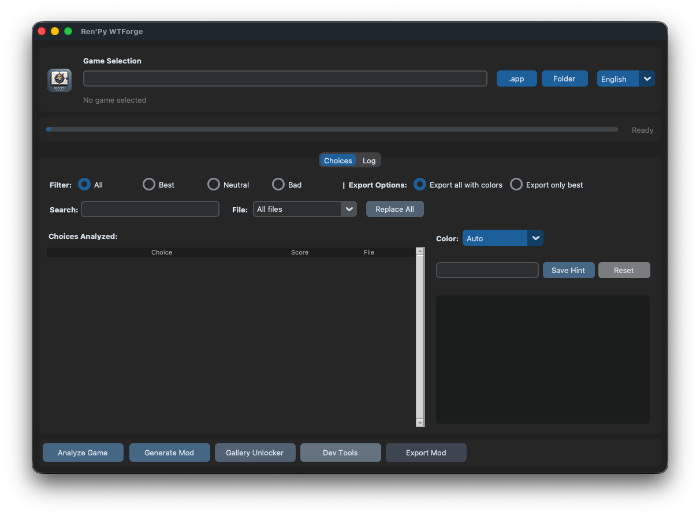

# 🎮 [Tool] Ren'Py WTForge v1.2.0 — Auto walkthrough mod generator

Hey everyone! 👋

**Ren'Py WTForge** is a universal GUI tool that automatically generates **walkthrough mods** for Ren'Py games. It color-codes choices, adds customizable hint labels, and can also create a universal gallery unlocker. No manual script editing required. 😎

---

## 📋 Quick Info

- **Name:** Ren'Py WTForge
- **Version:** 1.2.0
- **Platform:** Windows / macOS / Linux 🖥️
- **License:** As-is, use at your own risk ⚠️
- **Requirements:** Python 3.9+ and `customtkinter`, `pillow`

---

## ✨ What It Can Do

- 📦 Auto-extracts `.rpa` archives and decompiles `.rpyc` files.
- 🧠 Detects choices with numeric scores, booleans (`True`/`False`), and function calls like `change_relationship("alice", 1)`.
- 🎨 Color-codes choices:
  - 🟦 Best choices
  - 🟥 Bad choices
  - ⬜ Neutral choices
- ✏️ Custom hint text editor.
- 🖼️ One-click gallery unlocker for `award_manager` based games.
- 🔍 Filters + search, plus manual color override per choice.
- 🛤️ **Detected routes** — view jump/call targets per choice and filter by route.
- ✂️ **Concise in-game hints** — hints now display up to the 3 most impactful variables.
- 🧩 **Choice effects panel** — see all extracted effects per choice in the GUI details.
- ⚡ **Cached `.rpyc` decompilation** — skips decompilation when the `.rpy` is already newer.
- 📈 **Live progress bar** — progress updates during extraction, decompilation, and analysis.

---

## Screenshots

<!-- Replace with actual screenshots before posting -->
- 
- 

**In-game choices with color and hint label:**

```text
{color=#22c55e}My girlfriend.{/color}  {color=#facc15}(Alice +1){/color}
{color=#d63031}A friend.{/color}       {color=#facc15}(Alice -1){/color}
```

---

## ⬇️ Download

<!-- Replace with the actual download link / attachment before posting -->
- 🎁 **Latest release:** [RenPy-WTForge-v1.2.0.zip](LINK_HERE)
- 💻 **Source:** [GitHub repository](https://github.com/huchukato/RenPy-WTForge)

---

## 🚀 Installation & Quick Start

### macOS / Linux

```bash
./start.sh
```

### Windows

```bat
start.bat
```

### Manual

```bash
pip install customtkinter pillow
python3 wt_tool.py
```

---

## 🔄 How to Use

1. 🎮 **Select the game** — `.app` on macOS or game folder on Windows/Linux.
2. 🧠 **Analyze Game** — extracts `.rpa`, decompiles `.rpyc`, scans for choices.
3. 🔍 **Browse Choices** — use filters to review detected choices.
4. ✏️ **Edit Hint Text** — click a choice to customize its label.
5. 📤 **Choose Export Mode** — all choices with colors or only best ones.
6. 🚀 **Generate Mod** — creates `wtmod.rpy` inside the game directory.
7. 🖼️ **(Optional) Gallery Unlocker** — generate `wtmod_gallery.rpy` to unlock all CGs.

---

## 🆕 Changelog

### v1.2.0

- 🛤️ **Detected routes** — view jump/call labels per choice and filter by route.
- 🧩 **Choice effects panel** — see all extracted effects per choice in the GUI details.
- ✂️ **Concise in-game hints** — hints now display up to the 3 most impactful variables.
- 🌟 **Wildcard include/exclude filters** — fine-grained control over which variables affect scoring.
- ⚡ **Cached `.rpyc` decompilation** — skips decompilation when the `.rpy` is already newer.
- 📈 **Live progress bar** — progress now updates during extraction, decompilation, and `.rpy` analysis.
- 🪲 **Detected routes dropdown fix** — route selection now populates correctly.

### v1.1.0

- 🎨 **Manual color override** — choose Auto / Best / Neutral / Bad / None per choice directly in the GUI.
- 💾 **Per-game JSON auto-save** — manual hint and color edits are tracked inside the game as `game/wtmod/wtforge_edits.json` and reapplied on re-analysis.
- 🔍 **Search + file filter** — quickly find choices by text and filter by source `.rpy` file.
- 🌐 **Spanish UI** — language dropdown now supports English, Italian, and Spanish.
- 🟡 **Bright yellow hints** — generated in-game hint labels now use `#facc15`.
- 🔄 **Reset hint button** — restore the original auto-generated hint with one click.
- 🟨 **Manual edit highlight** — choices with custom hints or colors are highlighted in yellow in the list.
- 🔧 **Replace All** — bulk find/replace across choice hints.
- 🗑️ **Removed obsolete Save/Load Config buttons** — replaced by per-game auto-save.

### v1.0.0

- 🎉 Initial release of Ren'Py WTForge.
- 🎨 Color-coded choices with custom hint labels.
- 🖼️ Gallery unlocker generator.
- 🌐 English and Italian UI.
- 🖌️ Fresh color palette matching the new logo.
- 🖼️ Images centralized under `img/`.
- 🔧 `build/build.sh` reads version from `pyproject.toml` automatically.
- 🍎 New `build/build_mac_app.sh` for macOS `.app` bundles.

---

## 📝 Notes

- Mod files are placed in `game/wtmod/` (or `GameName.app/Contents/Resources/autorun/game/wtmod/` on macOS).
- The original game files are never modified.
- For best results, use Ren'Py Translator first if you plan to translate the game, then generate the WTForge mod.

---

## 🙏 Credits

- 💡 Original walkthrough mod concept by **[fergz](https://f95zone.to/threads/global-walkthrough-mod-for-most-renpy-games-1-1-fergz.128702/)** — Global Walkthrough Mod v1.1
- 🛠️ WTForge by **[huchukato](https://f95zone.to/members/huchukato.11155677/)** (F95Zone)
- 🔧 UnRen Tools by **huchukato, goobdoob, jimmy5 & Sam**
- 📦 rpatool by **[Shiz](https://codeberg.org/shiz/rpatool)**
- 🔓 unrpyc by **[CensoredUsername](https://github.com/CensoredUsername/unrpyc)**

---

Hope you find it useful! Happy modding! 🎉
