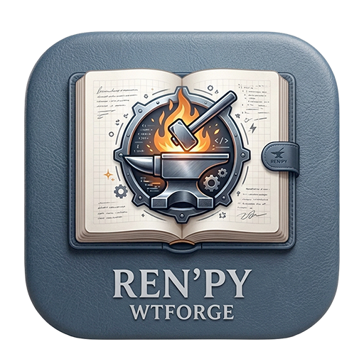
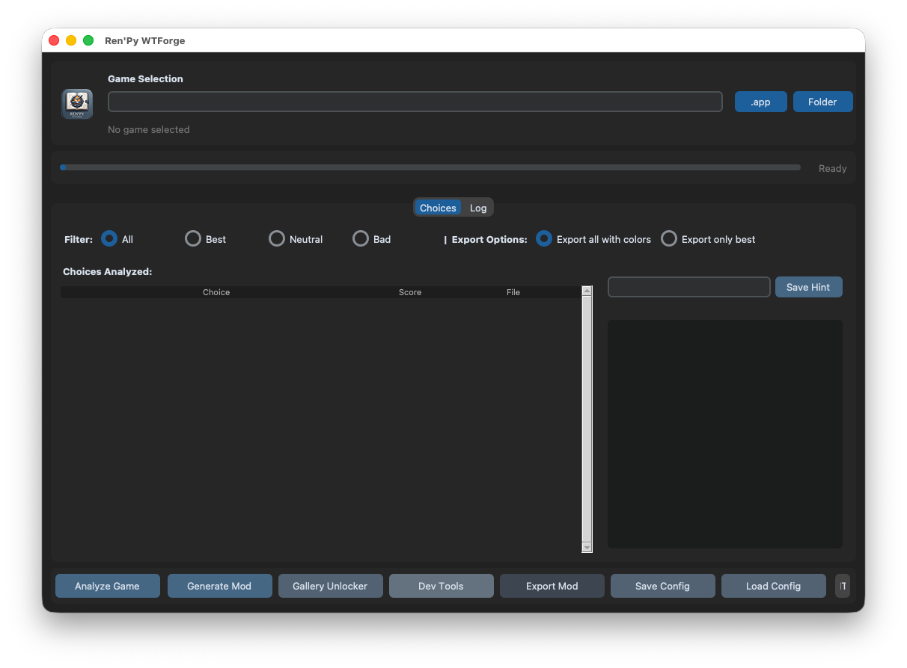

# 🎮 Ren'Py WTForge




> A universal GUI tool to automatically generate **walkthrough mods** for Ren'Py games — with color-coded choices, custom hint labels, and a gallery unlocker. No coding required.

---

## 🖥️ Screenshot

**GUI:**



---

## ✨ Features

| Feature | Description |
|---|---|
| 📦 **Auto Extraction** | Extracts `.rpa` archives using rpatool |
| 🔓 **Decompilation** | Decompiles `.rpyc` files using unrpyc |
| 🧠 **Smart Analysis** | Detects choices with numeric scores, booleans (`True`/`False`), and function calls (`change_relationship("alice", 1)`) |
| 🎨 **Color Coding** | 🟦 Best choices, 🟥 Bad choices, ⬜ Neutral choices |
| ✏️ **Hint Text Editor** | Customize the hint shown next to each choice (e.g. `rel_alice +1` → `Alice +1`) |
| 🖼️ **Gallery Unlocker** | One-click generator for a universal gallery unlock script |
| 🔍 **Filters** | Show All / Best / Neutral / Bad choices |
| 📤 **Export Modes** | Export all choices with colors OR only the best ones |
| 💾 **Save/Load Config** | Save your custom hints and reuse them across sessions |
| 🌐 **EN / IT UI** | Switch between English and Italian interface |


**In-game choices with color and hint label:**

```
{color=#4f728f}My girlfriend.{/color}  {color=#adaead}(Alice +1){/color}
{color=#d63031}A friend.{/color}       {color=#adaead}(Alice -1){/color}
```

---

## 📋 Requirements

- **Python 3.9+** — no external packages needed (stdlib only)
- **tkinter** — usually bundled with Python
  - Linux: `sudo apt-get install python3-tk`
  - macOS (Homebrew): `brew install python-tk`
- A Ren'Py game (`.app` on macOS or folder on Windows/Linux)

---

## 🚀 Quick Start

**Windows:**
```bat
start.bat
```

**macOS / Linux:**
```bash
./start.sh
```

**Or directly:**
```bash
python3 wt_tool.py
```

---

## 🔧 Workflow

1. **Select Game** — Click `.app` (macOS) or `Folder` (Windows/Linux) to select your game
2. **Analyze Game** — Extracts `.rpa`, decompiles `.rpyc`, scans all scripts for choices
3. **Browse Choices** — Use filters (All / Best / Neutral / Bad) to review detected choices
4. **Edit Hint Text** — Click a choice to edit its hint label (e.g. `ch2sharing +1` → `Sharing Route`)
5. **Choose Export Mode** — Export all choices with colors, or only the best ones
6. **Generate Mod** — Creates `wtmod.rpy` in the correct game directory
7. *(Optional)* **Gallery Unlocker** — Generate `wtmod_gallery.rpy` to unlock all CGs

---

## 📁 Output Structure

The mod files are saved automatically in the correct location for each platform:

**macOS (`.app`):**
```
GameName.app/Contents/Resources/autorun/game/wtmod/
├── wtmod.rpy              # Main mod: choice colors + hint dictionary + screen override
├── wtmod_screens.rpy      # Stub screen file
└── wtmod_config.json      # Variable configuration
```

**Windows / Linux:**
```
GameName/game/wtmod/
├── wtmod.rpy
├── wtmod_screens.rpy
└── wtmod_config.json
```

> A popup is shown after generation with the exact save path.

---

## 🌐 Using with Ren'Py Translator

If you also use **[Ren'Py Translator](https://github.com/huchukato/RenPy-Translator)** to translate the game, the recommended order is:

1. **Translate first** — run Ren'Py Translator to generate `game/tl/<lang>/`
2. **Generate mod after** — run WTForge so the mod picks up the translated choice texts automatically

> ⚠️ If you generate the mod **before** translating, the translation will overwrite the mod's choice labels with the original language. Always translate first.

---

## 🗂️ Project Structure

```
RenPy-WTForge/
├── wt_tool.py          # Main GUI (tkinter)
├── wt_analyzer.py      # Script parser — finds choices, variables, scores
├── wt_generator.py     # Mod file generator
├── wt_extractor.py     # .rpa extractor + .rpyc decompiler
├── start.bat           # Windows launcher
├── start.sh            # macOS/Linux launcher
├── config/             # Saved hint configurations
└── UnRen Tools/        # Bundled UnRen utilities
```

---

## ⚠️ Troubleshooting

| Problem | Solution |
|---|---|
| *"No .rpa files found"* | Game scripts may already be extracted as `.rpy` files — just click **Analyze** anyway |
| *Decompilation error* | Some games use obfuscation not supported by unrpyc |
| *tkinter not found* | Install it: `sudo apt-get install python3-tk` (Linux) or `brew install python-tk` (macOS) |
| *Gallery unlocker crashes* | Your game may not use `award_manager` — the unlocker will silently skip it and use a fallback |

---

## 🙏 Credits

- 💡 Original walkthrough mod concept and script analysis logic by **[fergz](https://f95zone.to/threads/global-walkthrough-mod-for-most-renpy-games-1-1-fergz.128702/)** — Global Walkthrough Mod v1.1
- 🛠️ WTForge GUI & mod generator by **[huchukato](https://f95zone.to/members/huchukato.11155677/)** (F95Zone)
- 🔧 UnRen Tools by **huchukato, goobdoob, jimmy5 & Sam**
- 📦 rpatool by **[Shiz](https://codeberg.org/shiz/rpatool)**
- 🔓 unrpyc by **[CensoredUsername](https://github.com/CensoredUsername/unrpyc)**

---

## 📄 License

This tool is provided **"as-is"** without any warranty. Use at your own risk.
The original game files are never modified — the mod is always placed in a separate `wtmod/` directory.
