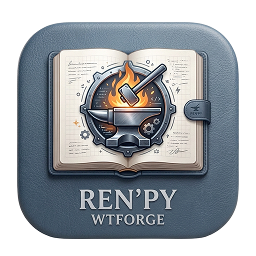

# 🎮 Ren'Py WTForge




> Uno strumento GUI universale per generare automaticamente **mod walkthrough** per i giochi Ren'Py — con scelte colorate, etichette hint personalizzabili e sblocco gallery. Nessun codice richiesto.

---

## 🖥️ Screenshot

**GUI:**


---

## ✨ Funzionalità

| Funzione | Descrizione |
|---|---|
| 📦 **Estrazione automatica** | Estrae archivi `.rpa` tramite rpatool |
| 🔓 **Decompilazione** | Decompila file `.rpyc` tramite unrpyc |
| 🧠 **Analisi intelligente** | Rileva scelte con punteggi numerici, booleani (`True`/`False`) e chiamate a funzione (`change_relationship("alice", 1)`) |
| 🎨 **Colorazione scelte** | 🟦 Scelte migliori, 🟥 Scelte peggiori, ⬜ Scelte neutre |
| ✏️ **Editor Hint** | Personalizza il testo hint accanto a ogni scelta (es. `rel_alice +1` → `Alice +1`) |
| 🎨 **Override colore manuale** | Cambia il colore automatico di ogni scelta: Migliore / Neutro / Cattivo / Nessuno |
| 🖼️ **Gallery Unlocker** | Rileva automaticamente award_manager / Ren'Py Gallery / flag CG persistenti e sblocca tutti i CG |
| 🔍 **Filtri + Ricerca** | Mostra Tutte / Migliori / Neutre / Cattive, cerca per testo e filtra per file `.rpy` |
| 📤 **Modalità esportazione** | Esporta tutte le scelte con colori OPPURE solo le migliori |
| 💾 **JSON modifiche per gioco** | Hint e colori manuali vengono auto-salvati dentro il gioco come `wtforge_edits.json` |
| 🌐 **IT / EN / ES** | Cambio lingua interfaccia: Italiano, Inglese, Spagnolo |
| 🔄 **Ripristina hint** | Tasto per tornare all'hint automatico originale |
| 🛤️ **Route rilevate** | Visualizza jump/call per scelta e filtra per route rilevata |
| ✂️ **Hint concisi** | Gli hint in-game mostrano fino a 3 variabili più rilevanti |
| 🧩 **Pannello effetti** | Visualizza tutti gli effetti estratti per scelta nel dettaglio GUI |
| ⚡ **Decompilazione cache** | Salta `.rpyc` se il `.rpy` corrispondente è già più recente |
| 📈 **Progresso live** | Barra avanzamento aggiornata durante estrazione, decompilazione e analisi |

---

**Scelte in gioco con colore e hint:**

```
{color=#22c55e}La mia ragazza.{/color}  {color=#facc15}(Alice +1){/color}
{color=#d63031}Un'amica.{/color}        {color=#facc15}(Alice -1){/color}
```

---

## 📋 Requisiti

- **Python 3.9+** — nessun pacchetto esterno necessario (solo stdlib)
- **tkinter** — di solito incluso con Python
  - Linux: `sudo apt-get install python3-tk`
  - macOS (Homebrew): `brew install python-tk`
- Un gioco Ren'Py (`.app` su macOS o cartella su Windows/Linux)

---

## 🚀 Avvio rapido

**Windows:**
```bat
start.bat
```

**macOS / Linux:**
```bash
./start.sh
```

**Oppure direttamente:**
```bash
python3 wt_tool.py
```

---

## 🔧 Flusso di lavoro

1. **Seleziona il gioco** — Clicca `.app` (macOS) o `Cartella` (Windows/Linux)
2. **Analizza il gioco** — Estrae `.rpa`, decompila `.rpyc`, analizza tutti gli script
3. **Sfoglia le scelte** — Usa i filtri (Tutte / Migliori / Neutre / Cattive)
4. **Modifica l'hint** — Clicca una scelta e personalizza il testo hint (es. `ch2sharing +1` → `Sharing Route`)
5. **Scegli la modalità** — Esporta tutte le scelte con colori, o solo le migliori
6. **Genera Mod** — Crea `wtmod.rpy` nella directory corretta del gioco
7. *(Opzionale)* **Sblocca Gallery** — Genera `wtmod_gallery.rpy` per sbloccare tutte le CG

---

## 📁 Struttura output

I file mod vengono salvati automaticamente nel percorso corretto per ogni piattaforma:

**macOS (`.app`):**
```
NomeGioco.app/Contents/Resources/autorun/game/wtmod/
├── wtmod.rpy              # Mod principale: colori + dizionario hint + screen override
├── wtmod_screens.rpy      # File screen stub
└── wtmod_config.json      # Configurazione variabili
```

**Windows / Linux:**
```
NomeGioco/game/wtmod/
├── wtmod.rpy
├── wtmod_screens.rpy
└── wtmod_config.json
```

> Dopo la generazione viene mostrato un popup con il percorso esatto di salvataggio.

---

## 🌐 Uso con Ren'Py Translator

Se usi anche **[Ren'Py Translator](https://github.com/huchukato/RenPy-Translator)** per tradurre il gioco, l'ordine consigliato è:

1. **Prima traduci** — esegui Ren'Py Translator per generare `game/tl/<lingua>/`
2. **Poi genera la mod** — esegui WTForge così la mod include automaticamente i testi tradotti

> ⚠️ Se generi la mod **prima** di tradurre, la traduzione sovrascriverà le etichette della mod con la lingua originale. Traduci sempre prima.

---

## 🗂️ Struttura del progetto

```
RenPy-WTForge/
├── wt_tool.py          # GUI principale (tkinter)
├── wt_analyzer.py      # Parser script — trova scelte, variabili, punteggi
├── wt_generator.py     # Generatore file mod
├── wt_extractor.py     # Estrattore .rpa + decompilatore .rpyc
├── start.bat           # Launcher Windows
├── start.sh            # Launcher macOS/Linux
├── config/             # Configurazioni hint salvate
└── UnRen Tools/        # Utility UnRen incluse
```

---

## ⚠️ Risoluzione problemi

| Problema | Soluzione |
|---|---|
| *"Nessun file .rpa trovato"* | Gli script del gioco potrebbero essere già estratti come `.rpy` — clicca comunque **Analizza** |
| *Errore di decompilazione* | Alcuni giochi usano obfuscation non supportata da unrpyc |
| *tkinter non trovato* | Installa con: `sudo apt-get install python3-tk` (Linux) o `brew install python-tk` (macOS) |
| *Gallery unlocker crasha* | Il gioco potrebbe non usare `award_manager` — lo script lo ignora silenziosamente e usa un fallback |

---

## 🙏 Crediti

- 💡 Concetto originale walkthrough mod di **[fergz](https://patreon.com/fergz)**
- 🔧 UnRen Tools di **huchukato, goobdoob, jimmy5 & Sam**
- 📦 rpatool di **[Shiz](https://codeberg.org/shiz/rpatool)**
- 🔓 unrpyc di **[CensoredUsername](https://github.com/CensoredUsername/unrpyc)**

---

## 📄 Licenza

Questo tool è fornito **"così com'è"** senza garanzie. Usalo a tuo rischio.
I file originali del gioco non vengono mai modificati — la mod viene sempre salvata nella directory separata `wtmod/`.
